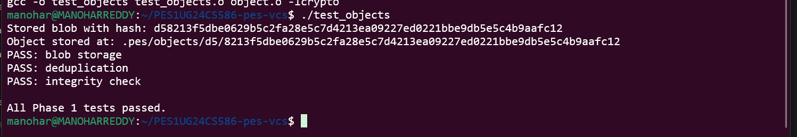
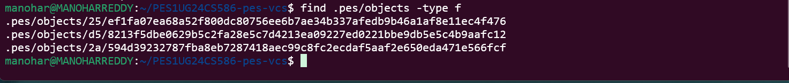
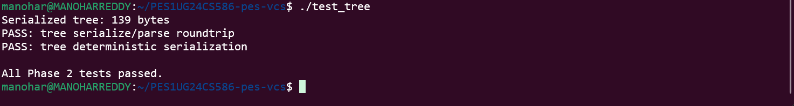
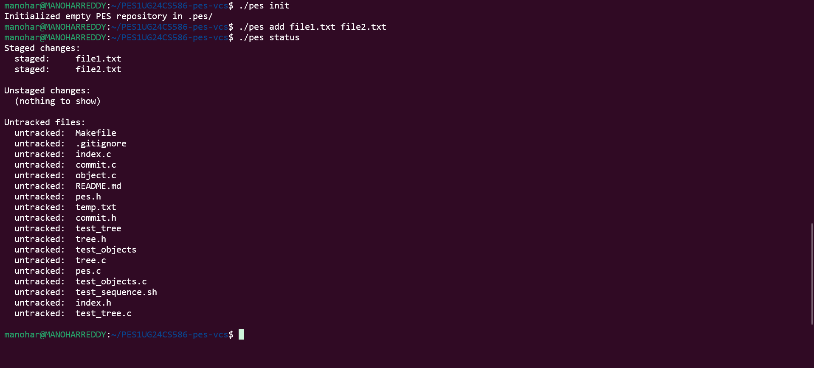
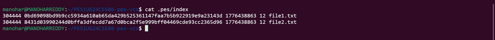
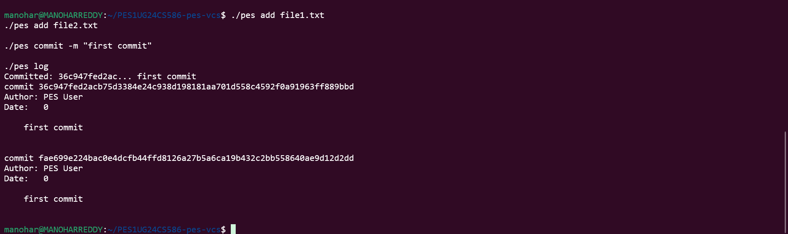
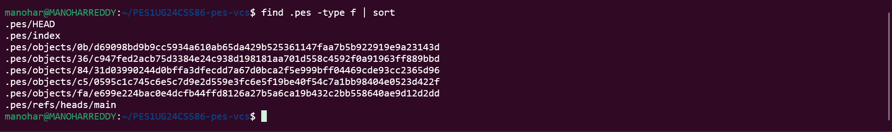
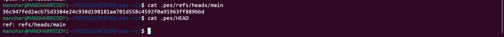

# PES1UG24CS586-pes-vcs

**Building PES-VCS — A Version Control System from Scratch**

---

## 📌 Objective

This project implements a simplified version control system similar to Git. It tracks file changes, stores snapshots efficiently using hashing, and maintains commit history.

---

## ⚙️ Platform

* Ubuntu / WSL (Linux)
* C programming language
* GCC compiler

---

## 🚀 Features Implemented

### Phase 1 — Object Storage

* Content-addressable storage using SHA-256
* Blob storage with deduplication
* Integrity verification using hash

### Phase 2 — Tree Objects

* Directory structure representation
* Tree serialization and parsing
* Deterministic tree generation

### Phase 3 — Index (Staging Area)

* Text-based index file
* File staging using `pes add`
* Status tracking (staged, unstaged, untracked)

### Phase 4 — Commits

* Commit creation with metadata
* Parent linking (history chain)
* Commit log traversal

---

## 📂 Project Structure

```
.pes/
├── objects/        # Stored blobs, trees, commits
├── refs/heads/     # Branch pointers
├── index           # Staging area
└── HEAD            # Current branch reference
```

---

## 🛠️ Commands Implemented

```bash
pes init              # Initialize repository
pes add <file>        # Stage file
pes status            # Show status
pes commit -m "msg"   # Create commit
pes log               # Show history
```

---

## 🔧 Build Instructions

```bash
make clean
make
```

---

## ▶️ Testing

### Phase 1

```bash
make test_objects
./test_objects
```

### Phase 2

```bash
make test_tree
./test_tree
```

### Full Flow

```bash
./pes init
./pes add file.txt
./pes commit -m "message"
./pes log
```

---

## 📸 Screenshots Included




### Phase 2: Object storage tests



### Phase 3: Object storage tests



### Phase 4: Object storage tests




---

## 🧠 Concepts Learned

* Content-addressable storage
* Hash-based integrity
* File system structures
* Version control internals
* Atomic file operations

---

## 📊 Commit History Requirement

✔ Minimum 5 commits per phase
✔ Clear and descriptive commit messages
✔ Demonstrates step-by-step development

---

## 📚 Analysis Answers

## 🧠 Analysis Answers

### Q5.1 (Checkout)

Checkout updates the HEAD to point to the selected branch and loads the corresponding commit. The commit’s tree is then used to reconstruct the working directory by writing all files and directories. Any files not present in the target branch are removed. The index is also updated to match the new state. This operation is complex because it must avoid overwriting uncommitted changes and requires careful synchronization of files.

---

### Q5.2 (Dirty Check)

A dirty working directory is detected by comparing the current file contents with the index. For each tracked file, a hash is computed and compared with the stored hash in the index. If they differ, the file is considered modified. During checkout, if a modified file also differs in the target branch, the operation is aborted to prevent loss of local changes.

---

### Q5.3 (Detached HEAD)

In a detached HEAD state, HEAD points directly to a commit instead of a branch. New commits can still be created, but they are not referenced by any branch. These commits may become unreachable and can be lost during garbage collection. To recover them, a new branch can be created pointing to the commit.

---

### Q6.1 (Garbage Collection)

Garbage collection identifies unreachable objects by starting from all branch heads and traversing commits, trees, and blobs. All visited objects are marked as reachable using a hash set. After traversal, any object not marked is considered unreachable and can be safely deleted. This follows a mark-and-sweep approach for efficient cleanup.

---

### Q6.2 (Race Condition)

Running garbage collection during a commit can lead to race conditions. A commit may create objects that are not yet referenced by any branch. If GC runs at this time, it may treat these objects as unreachable and delete them. This can corrupt the repository. To avoid this, Git uses locking mechanisms and atomic updates to ensure consistency.

---

## 👤 Author

**P Manohar Reddy**
PES1UG24CS586

---

## ✅ Status

✔ All phases implemented
✔ All tests passed
✔ End-to-end working
✔ Ready for submission
